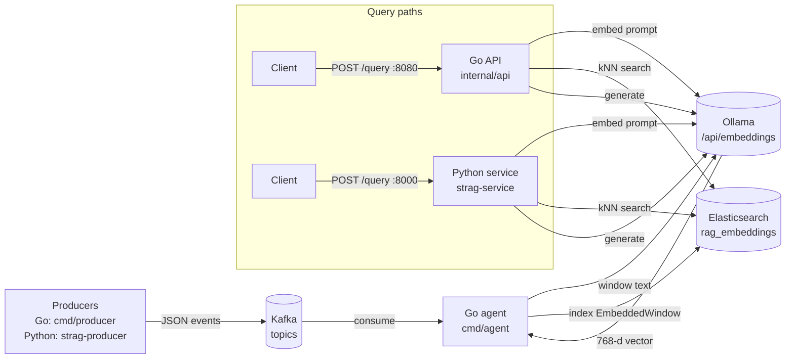
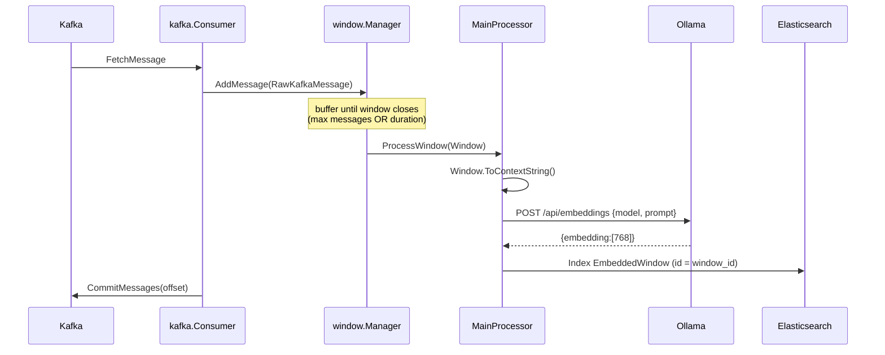
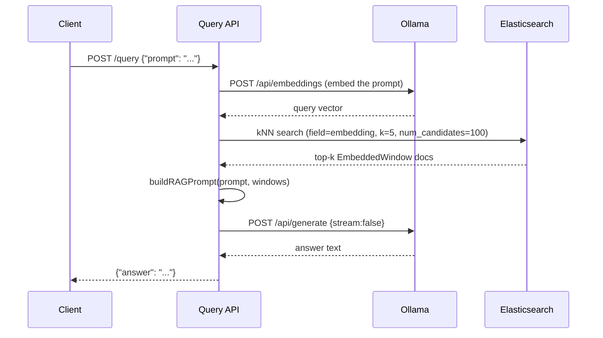

# Stream RAG Agent — Architecture & Contributor Guide

> **Audience:** engineers and autonomous sub-agents working on this repository.
> Read this before changing code. It is the source of truth for how the system
> fits together, the contracts that must not drift, the known defects, and the
> backlog of well-scoped work.

---

## 1. What this project is

A **streaming Retrieval-Augmented Generation (RAG)** system. It ingests
real-time events from Kafka, groups them into windows, embeds each window with
Ollama, stores the vectors in Elasticsearch, and answers natural-language
questions by retrieving the most similar windows and feeding them to an LLM.

It is a **polyglot (Go + Python)** project with a deliberate split:

| Side | Responsibility | Why this language |
| --- | --- | --- |
| **Go** | High-throughput streaming **ingestion** + a RAG query API on **:8080** | Concurrency, long-running consumers, low overhead |
| **Python** | ML/**query serving**: FastAPI RAG API on **:8000**, multi-topic producer, CLI | ML ecosystem, fast iteration on retrieval/serving |

The two sides never call each other directly. They interoperate **only** through
shared infrastructure: the same config file, the same Elasticsearch index, the
same Ollama server, and the same Kafka topics. Keeping those contracts in sync
(§5) is the single most important rule in this codebase.

---

## 2. System context



The Go agent process hosts **both** the ingestion pipeline and the Go query API.
The Python service is a **second, independent** query front-end over the same ES
index and Ollama — useful for iterating on retrieval/serving without touching the
ingestion hot path.

---

## 3. Data flow

### 3.1 Ingestion (Go only)



Window close triggers (`internal/window/manager.go`):
- **Count-based:** `MessageCount >= window_max_messages`.
- **Time-based:** a per-window ticker fires after `window_duration_seconds`.
- **Shutdown:** `FlushAllWindows()` closes everything still open.

After a window closes it is processed in a goroutine and a fresh window for the
same `topic/partition` is started immediately (continuous streaming).

### 3.2 Query (Go :8080 and Python :8000 are equivalent)



---

## 4. Component reference

### 4.1 Go (`module stream-rag-agent`, see `go.mod`)

| Path | Responsibility |
| --- | --- |
| `cmd/agent/main.go` | Process entry point. Wires config → ES client → embedding/LLM services → window managers → Kafka consumers → API server. Owns graceful shutdown. `MainProcessor.ProcessWindow` is the embed-and-store step. |
| `cmd/producer/main.go` | Standalone demo producer. Emits synthetic `financial_transactions` only. |
| `internal/config/config.go` | YAML → `AppConfig` structs (`Kafka`, `Ollama`, `Elasticsearch`). |
| `internal/kafka/consumer.go` | `segmentio/kafka-go` reader per topic; fetch → `window.Manager.AddMessage` → commit. |
| `internal/window/manager.go` | Windowing state machine. Thread-safe map keyed by `topic_partition`. Time + count flushers. Calls the `WindowProcessor` interface. |
| `internal/window/types.go` | `Window`, `RawKafkaMessage`, `EmbeddedWindow` (the ES document), and `Window.ToContextString()` (JSON → human-readable text, **capped at 10 messages**). |
| `internal/embedding/service.go` | Ollama `/api/embeddings` client. 30s timeout. |
| `internal/llm/service.go` | Ollama `/api/generate` client (`stream:false`). 120s timeout. |
| `internal/vectordb/elasticsearch.go` | `olivere/elastic/v7` client. Creates the index/mapping, `SaveEmbeddedWindow`, `SearchSimilarWindows` (kNN). |
| `internal/api/server.go` | HTTP server on `:8080`. `POST /query`, `GET /health`. `buildRAGPrompt` assembles the LLM prompt. `topK = 5` hardcoded. |

### 4.2 Python (`python/`, package `strag`, console scripts via `pyproject.toml`)

| Module | Responsibility | Mirrors (Go) |
| --- | --- | --- |
| `strag/config.py` | Loads the **same** `configs/configs.yml`; env overrides (§6). Locates config via explicit path → `$STRAG_CONFIG` → upward directory walk. | `internal/config` |
| `strag/ollama_client.py` | Async `/api/embeddings` + `/api/generate` client (`httpx`). | `internal/embedding`, `internal/llm` |
| `strag/es_client.py` | Sync ES client wrapped in `asyncio.to_thread`. Same index name, mapping, and kNN query shape. `EMBEDDING_DIMS = 768`. | `internal/vectordb` |
| `strag/rag.py` | `build_rag_prompt` (byte-compatible with Go `buildRAGPrompt`) + `RagPipeline.query`. | `internal/api` prompt logic |
| `strag/service.py` | FastAPI app on `:8000`. `POST /query`, `GET /health`. Resilient startup (ES-down is tolerated). Console script `strag-service`. | `internal/api` |
| `strag/producer.py` | Multi-topic Kafka producer (`financial_transactions` **and** `sensor_data`). `confluent-kafka`. Console script `strag-producer`. | `cmd/producer` (superset) |
| `strag/client.py` | CLI that POSTs to either query API. Console script `strag-query`. | — |

---

## 5. Shared contracts (DO NOT let these drift)

Any change to one of these **must** be applied to both Go and Python in the same
change set, and to the ES mapping where relevant.

### 5.1 Elasticsearch index `rag_embeddings`

Document = `EmbeddedWindow` (`internal/window/types.go`). JSON field names are the
contract:

```json
{
  "window_id":    "keyword",
  "topic":        "keyword",
  "partition":    "integer",
  "start_time":   "date",
  "end_time":     "date",
  "message_count":"integer",
  "context_text": "text",
  "embedding":    { "type": "dense_vector", "dims": 768, "index": true, "similarity": "cosine" }
}
```

- Document `_id` = `window_id` (idempotent upserts).
- `dims: 768` matches `nomic-embed-text`. **If the embedding model changes, update
  the mapping, the Go constant context, and `EMBEDDING_DIMS` in `es_client.py`
  together**, and reindex.
- kNN query shape both sides send: `{field: "embedding", query_vector: <vec>, k: 5, num_candidates: 100}`.

### 5.2 Ollama HTTP API

- Embeddings: `POST {url}/api/embeddings` → `{"model","prompt"}` ⇒ `{"embedding":[...]}`.
- Generation: `POST {url}/api/generate` → `{"model","prompt","stream":false}` ⇒ `{"response":"..."}`.

### 5.3 Query HTTP API (both :8080 and :8000)

- `POST /query` request: `{"prompt": "<string>"}`.
- Response: `{"answer": "<string>"}` on success, `{"error": "<string>"}` on failure.
- `GET /health` ⇒ `200`.

### 5.4 Kafka message schemas (producer ↔ windowing)

`financial_transactions` (Go + Python producers):
```json
{"transaction_id","amount","currency","type","timestamp","description","account_id"}
```
`sensor_data` (Python producer; Go has none yet):
```json
{"sensor_id","machine_id","temperature_c","pressure_bar","vibration_mm_s","status","timestamp"}
```
The windower treats message values as arbitrary JSON objects (`ToContextString`
just flattens key/values), so schema changes don't break ingestion — but they do
change the text that gets embedded, which affects retrieval quality.

### 5.5 RAG prompt

`build_rag_prompt` / `buildRAGPrompt` must stay textually identical so both APIs
produce comparable answers. If you change the preamble or formatting, change both.

---

## 6. Configuration

Single file: [`configs/configs.yml`](../configs/configs.yml) — read by **both**
stacks. Schema: `kafka` (brokers, consumer_group_id, topics[{name, context,
window_duration_seconds, window_max_messages}]), `ollama` (url, embedding_model,
llm_model), `elasticsearch` (addresses, index_name).

Python-only environment overrides (handy in containers):
`KAFKA_BROKERS`, `OLLAMA_URL`, `OLLAMA_EMBEDDING_MODEL`, `OLLAMA_LLM_MODEL`,
`ELASTICSEARCH_ADDRESSES`, `ELASTICSEARCH_INDEX`, `STRAG_HOST`, `STRAG_PORT`,
`STRAG_CONFIG`. **The Go side has no env overrides yet** — see backlog GO-1.

---

## 7. Repository layout

```
.
├── cmd/
│   ├── agent/main.go          # ingestion + Go query API
│   └── producer/main.go       # Go demo producer (financial only)
├── internal/
│   ├── api/ config/ embedding/ kafka/ llm/ vectordb/ window/
├── python/
│   ├── strag/                 # config, ollama_client, es_client, rag, service, producer, client
│   ├── pyproject.toml requirements.txt Dockerfile README.md
├── configs/configs.yml        # shared config
├── docker-compose.yml         # infra only: zookeeper, kafka, elasticsearch, kibana
├── docs/ARCHITECTURE.md       # this file
└── README.md
```

---

## 8. Build, run, local dev

```bash
# 0. Infra (Kafka, Elasticsearch, Kibana)
docker compose up -d

# 1. Ollama (on host)
ollama pull nomic-embed-text && ollama pull llama3

# 2. Go ingestion agent + :8080 API
go build ./...            # or: go build -o bin/agent ./cmd/agent
go run ./cmd/agent

# 3. Python query service + producer (separate venv)
cd python && python -m venv .venv
.venv\Scripts\activate     # Windows  (Unix: source .venv/bin/activate)
pip install -r requirements.txt && pip install -e .
strag-service                       # :8000
strag-producer --topic all --rate 10
strag-query "Are there any transactions in EUR?"
```

Quality gates expected to pass before a PR:
- Go: `go build ./...`, `go vet ./...`, `go test ./...` (once tests exist).
- Python: `python -m compileall strag`, `pytest` (once tests exist), and the app
  imports cleanly (`strag-service` boots with ES down).

---

## 9. Cross-language invariants checklist

When you touch any of these, update **all** listed places in one change:

- **Embedding dims / model** → ES mapping (`internal/vectordb`), `EMBEDDING_DIMS`
  (`python/strag/es_client.py`), config default.
- **ES document fields** → `EmbeddedWindow` struct tags, ES mapping, Python readers
  in `rag.py`.
- **kNN params (k, num_candidates)** → `internal/vectordb` + `es_client.py`.
- **RAG prompt text** → `internal/api/server.go` + `python/strag/rag.py`.
- **Query API request/response shape** → `internal/api` + `strag/service.py` + `strag/client.py`.
- **New Kafka topic** → `configs/configs.yml` + a producer generator.

---

## 10. Known issues / tech debt

Each item lists the file and the fix direction. These are real defects found in
the current code, not hypotheticals.

| ID | Severity | Location | Problem |
| --- | --- | --- | --- |
| KI-1 | **High** | `internal/api/server.go` (`WriteTimeout: 10s`) | LLM generation can take up to 120s, but the HTTP server write timeout is 10s, so `/query` responses are cut off for any non-trivial answer. Raise/ remove `WriteTimeout` (or stream), keep it ≥ the LLM timeout. |
| KI-2 | **High** | `cmd/agent/main.go` (`LoadConfig("../configs/configs.yml")`) | Relative path breaks when the agent is run from the repo root (`go run ./cmd/agent`). Resolve via a flag/env (`STRAG_CONFIG`) or locate the file robustly. |
| KI-3 | Medium | `internal/vectordb/elasticsearch.go` (mapping string) | The mapping JSON contains `//` comments, which is not valid JSON. It may work only because ES's parser is lenient. Remove the comments to avoid a brittle index-creation failure. |
| KI-4 | Medium | `cmd/agent/main.go` | Partition is hardcoded to `0` (`wm.Start(0)`, `StartConsuming(ctx, 0)`). Multi-partition topics are not consumed correctly. Use the reader's assigned partitions. |
| KI-5 | Medium | `internal/vectordb` + `es_client.py` | kNN retrieval is **not** filtered by topic, so a financial query can surface sensor windows. Add an optional topic filter to the query API. |
| KI-6 | Low | `internal/api/server.go` (`topK = 5`) | Retrieval size is hardcoded. Make it configurable. |
| KI-7 | Low | `internal/window/manager.go` (`closeWindow`) | On shutdown, `closeWindow` spawns a goroutine that re-creates a new window and flusher even while shutting down; can race with `FlushAllWindows`. Gate re-creation on a "running" flag. |
| KI-8 | Low | whole repo | No tests (Go or Python). See TEST-1/TEST-2. |
| KI-9 | Low | `cmd/producer/main.go` | Go producer only emits `financial_transactions`; `sensor_data` has no Go producer (Python covers it). Decide whether Go needs one. |

---

## 11. Task backlog for sub-agents

Tasks are scoped to be independently grabbable. Each states the **side**, the
**files**, and **acceptance criteria**. Prefer vertical slices; keep the §5
contracts in sync.

### Correctness / bugs
- **GO-KI1 — Fix `/query` write timeout (KI-1).** _Go._ Files: `internal/api/server.go`.
  AC: a query that takes 60–90s returns the full answer without the connection
  being closed; `/health` still responds quickly.
- **GO-KI2 — Robust config path (KI-2).** _Go._ Files: `cmd/agent/main.go`,
  `internal/config/config.go`. AC: `go run ./cmd/agent` from repo root loads
  `configs/configs.yml`; a `--config`/`STRAG_CONFIG` override works.
- **GO-KI3 — Clean ES mapping JSON (KI-3).** _Go._ Files: `internal/vectordb/elasticsearch.go`.
  AC: mapping string is valid JSON (no comments); index creates on a fresh ES.

### Features
- **BOTH-1 — Topic-scoped retrieval (KI-5).** _Go + Python._ Add optional
  `topic` to the `/query` request and a filter to the kNN query on both sides.
  AC: a request with `topic` only returns windows from that topic; contracts
  §5.1/§5.3 updated in both stacks.
- **BOTH-2 — Configurable top-k (KI-6).** _Go + Python._ AC: `k` comes from config
  or request; default stays 5.
- **PY-1 — Stream responses / SSE.** _Python._ Add a streaming variant of
  `/query` using Ollama `stream:true`. AC: tokens arrive incrementally; the
  non-streaming endpoint is unchanged.
- **GO-KI4 — Multi-partition consumption (KI-4).** _Go._ AC: a topic with >1
  partition has all partitions consumed and windowed.

### Testing & tooling
- **TEST-1 — Go unit tests.** _Go._ Target `window` (window-close logic,
  `ToContextString`) and `api.buildRAGPrompt` with fakes for Ollama/ES. AC:
  `go test ./...` green in CI; no live infra required.
- **TEST-2 — Python unit tests.** _Python._ `pytest` for `config` (env overrides),
  `rag.build_rag_prompt`, producer generators, and `service` `/health` + empty
  prompt via `TestClient`. AC: `pytest` green with ES/Ollama absent.
- **CI-1 — CI pipeline.** Add a workflow running the Go and Python gates from §8.

### Ops
- **OPS-1 — App containers + compose profile.** Add the Go agent to Docker and an
  optional compose profile wiring Go+Python+infra (Ollama stays on host or as a
  service). AC: `docker compose --profile apps up` brings up a working stack.

---

## 12. Working conventions for sub-agents

- **Stay in your slice.** Touch only the files your task names; flag unrelated
  issues rather than fixing them inline.
- **Keep Go and Python in sync.** If your change affects a §5 contract, change
  both sides (and the ES mapping) in the same PR, and update §5 here.
- **Update this guide.** If you change architecture, contracts, or fix a Known
  Issue, edit the relevant section (and move the KI row to "done" in your PR body).
- **Branch names:** `feat/<thing>`, `fix/<thing>`, `test/<thing>`, `docs/<thing>`.
- **Definition of done:** code builds; the §8 quality gates pass; behavior
  verified (a test, or a documented manual run); docs/contracts updated.
- **Don't weaken security defaults silently.** ES security is disabled for *local*
  only; never commit real credentials or expose services without saying so.
- **Config is shared.** Never hardcode brokers/URLs/index names that belong in
  `configs/configs.yml`.
```
